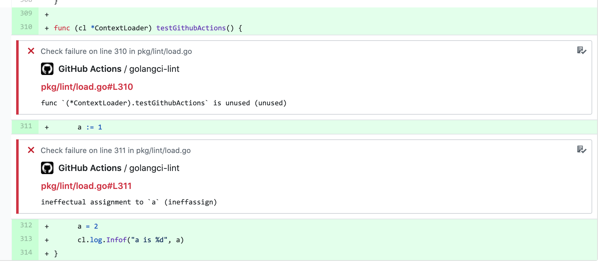

# golangci-lint-action

[](https://github.com/golangci/golangci-lint-action/actions)



The action that runs [golangci-lint](https://github.com/golangci/golangci-lint) and reports issues from linters.

## How to use

1. Create a [GitHub token](https://github.com/settings/tokens/new) with scope `repo.public_repo`.
2. Add it to a [repository secrets](https://help.github.com/en/actions/configuring-and-managing-workflows/creating-and-storing-encrypted-secrets#creating-encrypted-secrets): repository -> `Settings` -> `Secrets`.
3. Add `.github/workflows/golangci-lint.yml` with the following contents:

```yaml
name: golangci-lint
on:
  push:
    tags:
      - v*
    branches:
      - master
  pull_request:
jobs:
  golangci:
    name: lint
    runs-on: ubuntu-latest
    steps:
      - uses: actions/checkout@v2
      - name: golangci-lint
        uses: golangci/golangci-lint-action@v1
        with:
          # Required: the version of golangci-lint is required and must be specified without patch version: we always use the latest patch version.
          version: v1.26

          # Optional: golangci-lint command line arguments.
          # args: ./the-only-dir-to-analyze/...

          # Required: GitHub token with scope `repo.public_repo`. Used for fetching a list of releases of golangci-lint.
          github-token: ${{ secrets.GOLANGCI_LINT_GITHUB_TOKEN }}
```

## Comments and Annotations

Currently, GitHub parses the action's output and creates [annotations](https://github.community/t5/GitHub-Actions/What-are-annotations/td-p/30770).

The restrictions of annotations are the following:

1. Currently, they don't support markdown formatting (see the [feature request](https://github.community/t5/GitHub-API-Development-and/Checks-Ability-to-include-Markdown-in-line-annotations/m-p/56704))
2. They aren't shown in list of comments like it was with [golangci.com](https://golangci.com). If you would like to have comments - please, up-vote [the issue](https://github.com/golangci/golangci-lint-action/issues/5).

## Internals

We use JavaScript-based action. We don't use Docker-based action because:

1. docker pulling is slow currently
2. it's easier to use caching from [@actions/cache](https://github.com/actions/cache) until GitHub team hasn't supported reusing actions from actions

Inside our action we perform 3 steps:

1. Setup environment running in parallel:
  * restore [cache](https://github.com/actions/cache) of previous analyzes into `$HOME/.cache/golangci-lint`
  * list [releases of golangci-lint](https://github.com/golangci/golangci-lint/releases) and find the latest patch version
    for needed version (users of this action can specify only minor version). After that install [golangci-lint](https://github.com/golangci/golangci-lint) using [@actions/tool-cache](https://github.com/actions/toolkit/tree/master/packages/tool-cache)
  * install the latest Go 1.x version using [@actions/setup-go](https://github.com/actions/setup-go)
2. Run `golangci-lint` with specified by user `args`
3. Save cache from `$HOME/.cache/golangci-lint` for later builds

## Development of this action

1. Install [act](https://github.com/nektos/act#installation)
2. Make a symlink for `act` to work properly: `ln -s . golangci-lint-action`
3. Get a [GitHub token](https://github.com/settings/tokens/new) with the scope `repo.public_repo`. Export it by `export GITHUB_TOKEN=YOUR_TOKEN`.
4. Prepare deps once: `npm run prepare-deps`
5. Run `npm run local` after any change to test it